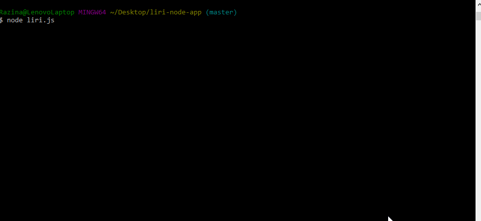
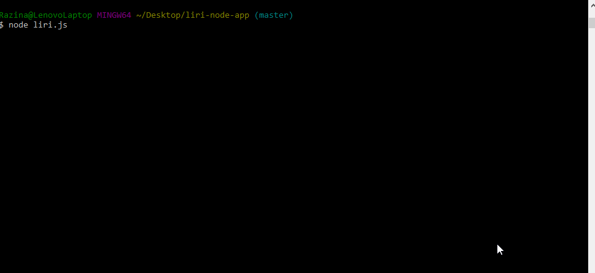
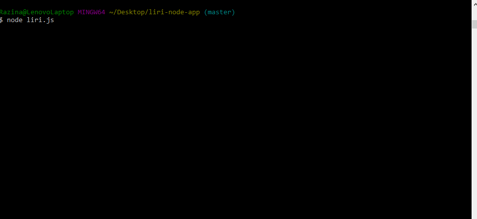

# **liri-node-app (Language Interpretation and Recognition Interface)**

## About LIRI
LIRI is like iPhone's SIRI. However, while SIRI is a Speech Interpretation and Recognition Interface, LIRI is a Language Interpretation and Recognition Interface. LIRI will be a command line node app that takes in parameters and gives you back data.

## What LIRI does and what to input

Commands | Functions | Description
------------ | ------------- | -------------
Concert This | ```node liri.js concert-thisMaroon5``` | Uses the bandsintown API to take a band name from the user and returns that bands next concert
Spotify for songs | ```node liri.js spotify-this-song i like it``` | Uses the spotify API to take a song name from the user and returns the artist, song name, spotify-link and album
OMDB for movies | ```node liri.js movie-this Frozen``` | Uses the OMDB API to take a movie name and returns the name, cast, release year, IMDB and Rotten Tomatoes rating, country of origin, language and plot
Do What It Says | ```node liri.js do-what-it-says``` | uses the built in readFile() method to access data from a prepopulated .txt file and return its information as a command/search query

## User Instructions
1. Be sure to clone the git project.
2. Run npm install from the console to make sure you get all the required dependencies
3. Make sure you add the following to your .env file:

### **Spotify API Key**
[Spotify](https://developer.spotify.com/my-applications/#!/)

SPOTIFY_ID= _your-ID_

SPOTIFY_SECRET= _your-secret_

### **OMDB API key**
[OMDB](http://www.omdbapi.com/apikey.aspx)

OMDB_ID="_your-api-key_"

### **BandCamp API**
[BandCamp](https://bandcamp.com/developer#calling_the_api)

BANDCAMP_ID="_your-api-key_"

## Functionality

1. Spotify for songs

    Function takes the userInput (command) and the userQuery(artist), and returns the next concert time and date for that artist, as well as location and city.

2. Bands in Town for concerts
    Function takes the userInput (command) and the userQuery(song), and returns the artist, full track name, a preview link and the album.

3. OMDB for movies
    Function takes the userInput (command) and the userQuery(song), and returns title, cast, release date, ratings, country of origin, original language and synopsis. 

4. Do what it says
    This function will randomly select one of the functions and produce a search. Try and find out what it does!

| Functiion | Result | 
|:---: |:-----: 
| concert-this |  
| spotify-this-song |  
| movie-this |  
| do-what-it-says |   


## Technologies Used:
*nodeJS
*MySQL
*Javascript

## *Hope That You Enjoy LIRI Bot!*